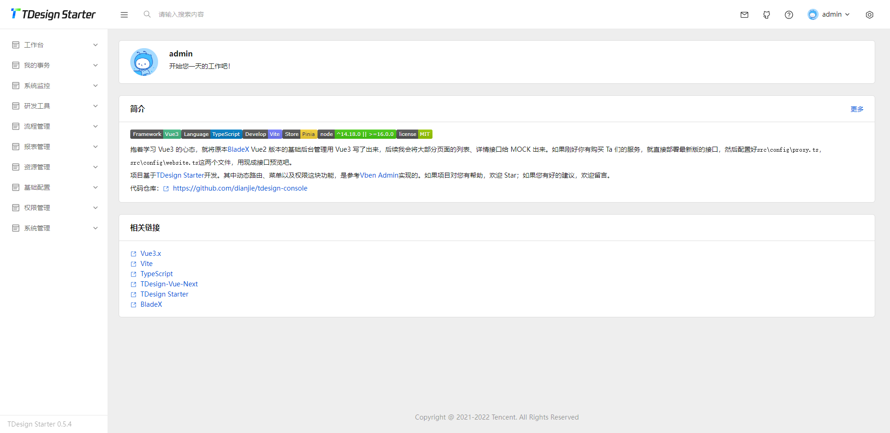

<p align="center">
  <a href="https://nodejs.org/en/about/releases/"></a>
  <a href="https://github.com/dianjie/tdesign-console/LICENSE">
    
  </a>
</p>


### 项目简介

基于[TDesign Starter](https://github.com/tencent/tdesign-vue-next-starter)将[BladeX](https://saber.bladex.vip/)的基础后台功能全部写了出来，支持动态路由。


### 特性

- [x] [Vue3.0](https://vuejs.org/)
- [x] [Vue Router](https://github.com/vuejs/router)
- [x] [TypeScript](https://www.typescriptlang.org/)
- [x] [Vite](https://vitejs.dev/)
- [x] [Pinia](https://pinia.vuejs.org/)
- [x] [Pinia持久化](https://github.com/prazdevs/pinia-plugin-persistedstate)
- [x] [TDesign-Vue-Next](https://tdesign.tencent.com/vue-next/overview)
- [x] [Less](https://lesscss.org/)
- [x] [vueuse](https://github.com/vueuse/vueuse)
- [x] [axios](https://github.com/axios/axios)
- [x] [ESLint](https://eslint.org/)
- [x] [Prettier](https://prettier.io/)
- [x] [Stylelint](https://stylelint.io/)
- [x] [Commitlint](https://github.com/conventional-changelog/commitlint)





### 目录说明

```bash

├─api               // api地址
├─assets            // 本地资源
├─components        // 公用组件
├─config            // 项目相关配置
├─directives        // Vue指令
├─hooks             // 常用的hook函数
├─layouts           // route layout
├─pages             // 基础路由相关组件
├─router            // 路由
├─store             // pinia store
├─styles            // 公用样式
├─types             // typescript types
├─utils             // 工具类函数
├─views             // 动态路由最终绑定的comopnent
└─viewsBusiness     // 动态路由落地页关联业务

```


### 使用前配置


```js

src\config\global.ts // css前缀等
src\config\proxy.ts // vite代理，没配置前请使用 npm run dev:mock 预览
src\config\website.ts //项目配置

```


### 开发

``` bash
## 安装依赖
npm install

## Vite代理启动项目
npm run dev

## 本地mock启动项目
npm run dev:mock
```

### 构建

```bash
## 构建正式环境
npm run build

## 构建测试环境
npm run build:test

## 将mock数据打包进最终代码内
npm run build:test
```

### 兼容性

| [](http://godban.github.io/browsers-support-badges/)</br> IE / Edge | [](http://godban.github.io/browsers-support-badges/)</br>Firefox | [](http://godban.github.io/browsers-support-badges/)</br>Chrome | [](http://godban.github.io/browsers-support-badges/)</br>Safari |
| ---------------------------------------------------------------------------------------------------------------------------------------------------------------------------------------------------------------- | ----------------------------------------------------------------------------------------------------------------------------------------------------------------------------------------------------------------- | ------------------------------------------------------------------------------------------------------------------------------------------------------------------------------------------------------------- | ------------------------------------------------------------------------------------------------------------------------------------------------------------------------------------------------------------- |
| Edge >=84                                                                                                                                                                                                        | Firefox >=83                                                                                                                                                                                                      | Chrome >=84                                                                                                                                                                                                   | Safari >=14.1                                                                                                                                                                                                  |


### 后续计划

- [ ] 封装Crud组件，通过JSON配置化生成相关Crud逻辑


### 推荐的IDE设置

[VSCode](https://code.visualstudio.com/) + [Volar](https://marketplace.visualstudio.com/items?itemName=Vue.volar) (工作区禁用 `Vetur`) + [TypeScript Vue Plugin (Volar)](https://marketplace.visualstudio.com/items?itemName=Vue.vscode-typescript-vue-plugin).


### 参考列表

[Vben Admin](https://github.com/vbenjs/vue-vben-admin)


### 开源协议

遵循 [MIT 协议](https://github.com/dianjie/tdesign-console/LICENSE)。

